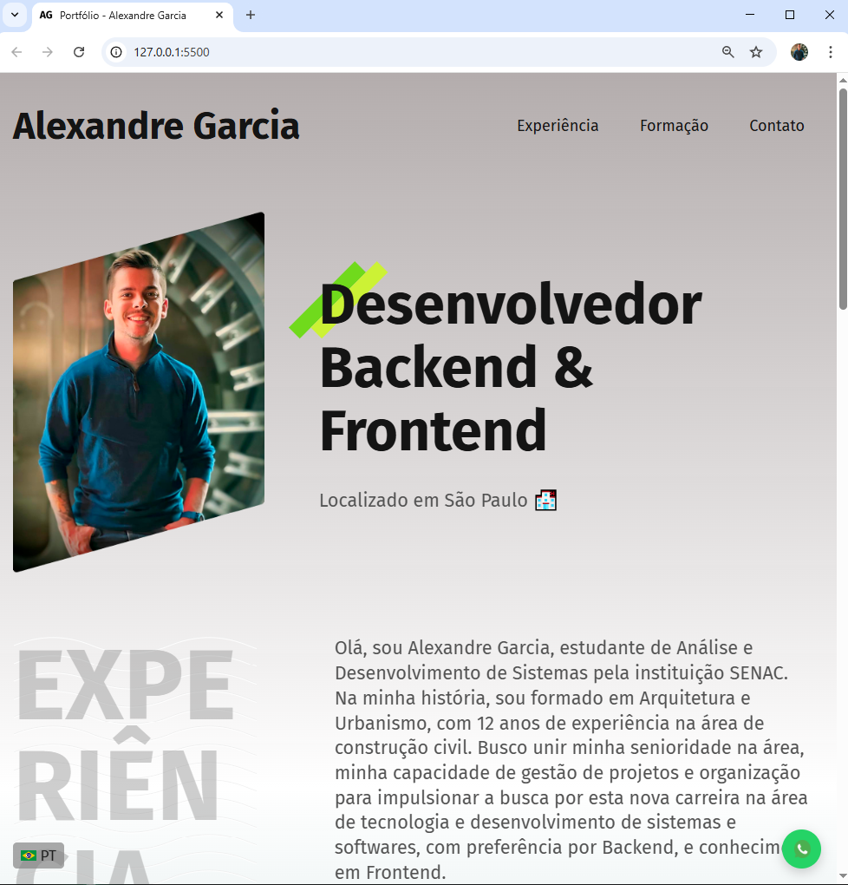

### Página HTML e CSS

- #### Portifólio pessoal com responsividade com informações, formação e experiência pessoal.

### Tecnologias:

  

### Funcionalidades utilizadas:

- Página Web de venda responsiva
- Efeitos de hover
- Menu Sanduiche
- Botão de Whatsapp

### Visualização:

http://alexandregarciajr.com  
https://alexandregarciajr.github.io/

