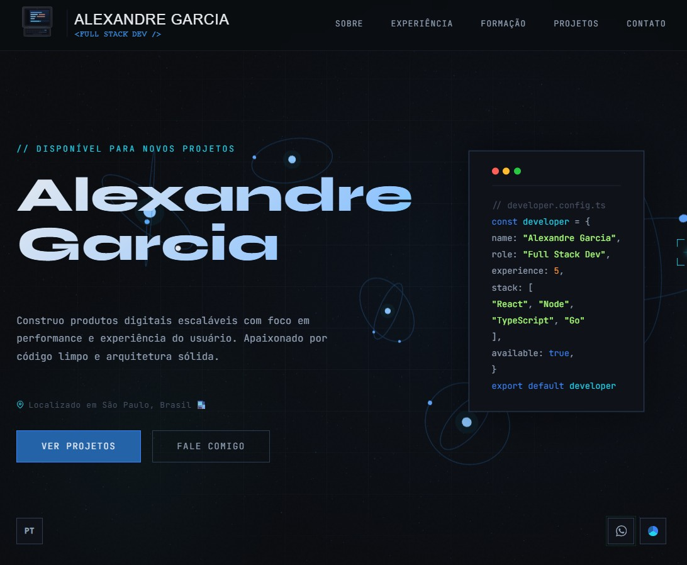

### Site Alexandre Garcia

- #### Portifólio pessoal com responsividade, informações, formação e experiência pessoal

### Tecnologias:

   

### Funcionalidades utilizadas:

- Página Web de venda responsiva
- Three.js
- Atom.js
- Efeitos de hover
- Menu Sanduiche
- Botão de Whatsapp
- Theme Switch
- Botão de tradução para três línguas
- Mobile First
- SEO
- Google Search Console Configuration

### Visualização:

<!-- http://alexandregarciajr.com   -->
https://alexandregarciajr.github.io/

